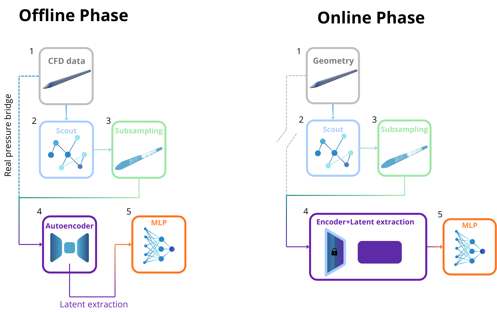
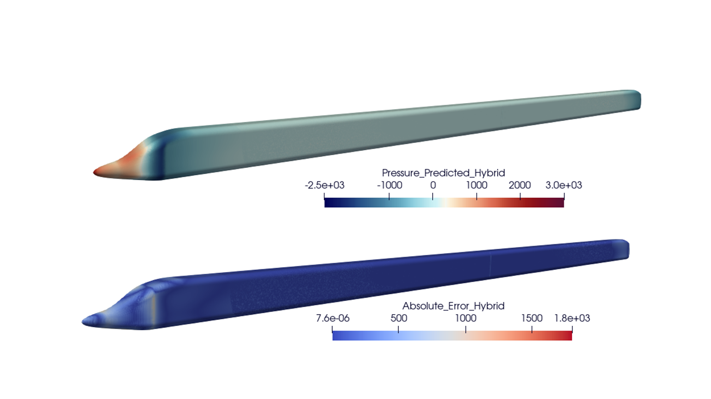
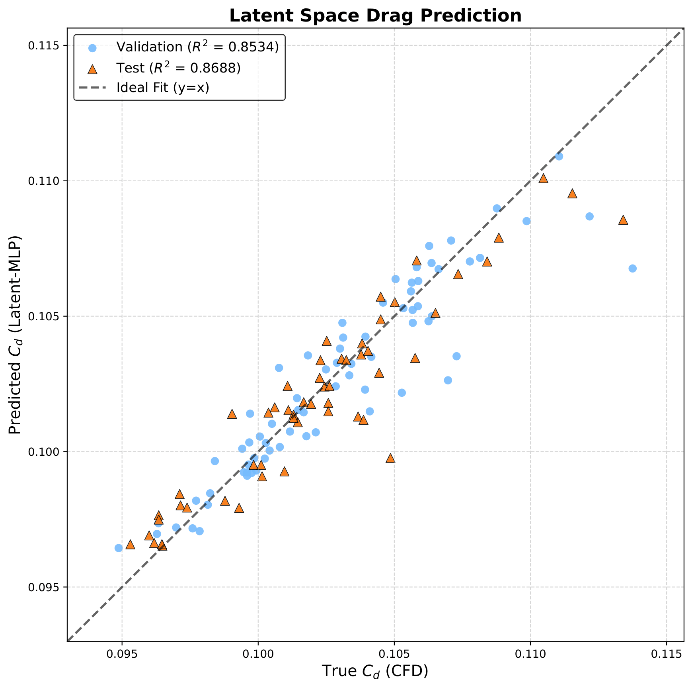

# GAT-AE Surrogate Model for Aerodynamics

This repository contains a **sandbox implementation** of a Graph Neural Network (GNN) surrogate model designed for aerodynamic field prediction. 

The code presented here acts as a simplified 2D pipeline demonstrating the core architecture and methodologies developed during my Master\'s Thesis, which originally targeted highly complex 3D aerodynamic simulations on high-speed trains.

## 🚀 Core Methodology (The 2-Stage Pipeline)

To handle massive computational fluid dynamics (CFD) meshes without running out of memory, this project introduces a **Hybrid Upsampling** approach:

1. **Physics Scout GAT**: A lightweight Graph Attention Network predicts a coarse pressure field across the entire domain.
2. **Smart Subsampling**: Nodes are ranked using an *Importance Score* (50% physical gradient magnitude + 50% absolute pressure value). Only the most critical nodes (e.g., wakes, stagnation points) are kept.
3. **Deep GAT Autoencoder**: A heavy Autoencoder reconstructs the high-fidelity pressure field *only* on the subsampled critical nodes, guided by a punitive loss function ( \times Importance^3$).
4. **Hybrid Merging**: The detailed Autoencoder predictions are mapped back over the Scout\'s coarse field.
5. **Latent Space MLP**: The compressed global bottleneck vector $ extracted from the Autoencoder is used to predict the global aerodynamic Drag Coefficient ($).

---

## 🚄 Original Thesis Results (3D High-Speed Trains)

While this repository contains the 2D sandbox code, the methodology was successfully applied to massive 3D surface meshes of high-speed trains. Below are the results from the full-scale thesis workflow:

### 1. Architectural Workflow

> *Overview of the two-stage GNN pipeline applied to 3D point clouds.*

### 2. Surface Pressure Field Reconstruction

> *Left: Ground Truth CFD | Middle: Hybrid GNN Prediction | Right: Mean Absolute Error (MAE)*

### 3. Drag Coefficient ($) Parity Plot

> *The MLP trained on the Autoencoder\'s latent space $ achieves extremely high accuracy in predicting the global drag coefficient.*

---

## 🛠️ Getting Started (Sandbox 2D Pipeline)

To experiment with the core concepts, you can run the simplified 2D pipeline directly in Google Colab:

1. Open the **	rain.ipynb** notebook.
2. The notebook is fully automated: it will download the toy dataset, generate the k-NN graphs, train the Scout, perform smart subsampling, train the punitive Autoencoder, and generate the final hybrid parity plots.

